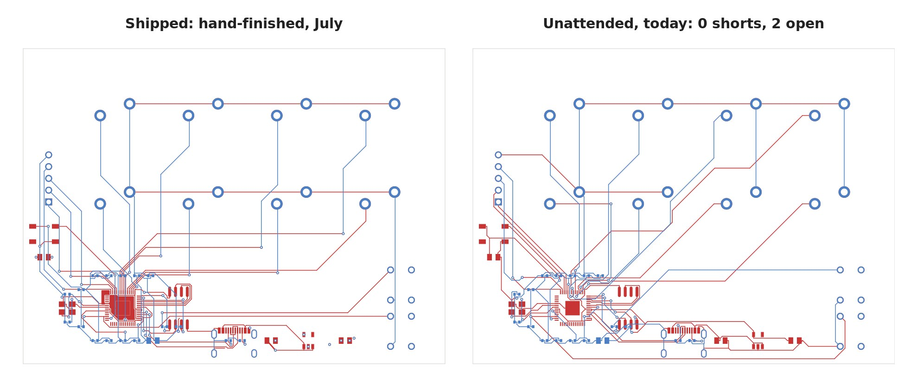
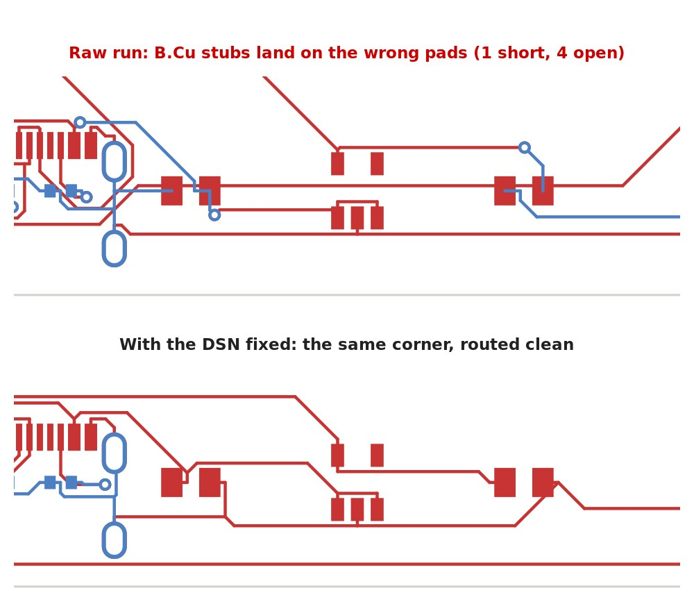

# pcb-rerun — einhander re-routed unattended (2026-10-01)

A side-by-side re-run of the PCB pipeline next to the shipped board in [`../pcb`](../pcb). Same
circuit (`index.circuit.tsx` + `modules/` are unchanged), routed with **nobody touching it**, to
measure how close the code-driven pipeline gets on its own. Write-up:
[punkfab.com/blog/einhander-reroute](https://punkfab.com/blog/einhander-reroute/).



## Result

|                              | Shipped (`../pcb`, July, hand-finished) | Unattended, raw | Unattended + `dsn_split_sides` |
|------------------------------|------|------|------|
| Shorts                       | 0    | 1    | **0** |
| Unconnected                  | 0    | 6    | **2** |
| Dangling tracks              | 2    | 3    | **0** |
| Board-specific patch scripts | 3    | —    | **0** |
| Track length                 | 1464 mm | 1461 mm | 1421 mm |
| Vias                         | 49   | 35   | 32   |

**Not fabbable yet** — two nets are open (QSPI_SCLK, one USB_DP pad). Use `../pcb` for fab.

## What was wrong

tscircuit's Specctra DSN export dedupes footprint images by name. C11 (0805, **bottom** side)
defined the shared 0805 image, so top-side C_IN / C_OUT / C_LED were handed to Freerouting as
mirrored bottom-side parts. Every short/open in the raw run was on those three parts — the
"dense LDO corner" that `../pcb/scripts/fix_ldo_planes.py` and `patch_stragglers.py` hand-patched.



## What changed vs `../pcb`

- `scripts/dsn_split_sides.py` (new, wired into `route4.sh` step 2a) — rebuilds DSN images for any
  part whose pins disagree with the KiCad pads, compared in absolute board coordinates.
- `scripts/drc_check.py` — unconnected items now count as blocking (it printed `CLEAN` with open nets).
- `scripts/board_metrics.py` (new) — track length / segments / vias / zones for a `.kicad_pcb`.
- `scripts/dsn_freeze_ses.py` — **dead end**, kept as a record: freezing the routed SES as fixed DSN
  wiring for a tail-only second pass stalls Freerouting 2.2.4.
- `index.circuit.kicad_pcb` is the unattended + fix result (= `results/stage1-with-split-fix.kicad_pcb`).
- `fab/` and `renders/` were left out — they belong to the shipped board.

All of these are also in the `pcb-layout` skill:
[punkfab/circuit-skills](https://github.com/punkfab/circuit-skills).

## Reproduce

```bash
cd pcb-rerun
npm install                                   # tscircuit CLI (node_modules not committed)
DISPLAY=:0 bash scripts/route4.sh             # ~30 s: export -> DSN prep -> freert224 -> KiCad IPC -> DRC
/usr/bin/python3 scripts/board_metrics.py index.circuit.kicad_pcb
```

Needs the same toolchain as `../pcb`: bun/tsci, Freerouting 2.2.4 + JDK 25 (`freert224`), KiCad 9
with the IPC API (`kipy`), and system python with `pcbnew`.

## results/

| file | what |
|------|------|
| `stage0-raw-autorun.kicad_pcb`, `stage0-drc.json`, `stage0-metrics.json` | unattended run before the fix |
| `stage1-with-split-fix.kicad_pcb`, `stage1-drc.json`, `stage1-metrics.json` | unattended run with `dsn_split_sides.py` |
| `shipped-metrics.json` | the same metrics for `../pcb/index.circuit.kicad_pcb` |
| `compare.jpg`, `corner.jpg` | the figures from the blog post (KiCad F.Cu/B.Cu plots) |
